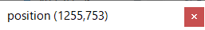

# いまどこポインタ

現在のマウスポインタの位置を表示するだけのツール。

## 動作環境

Windows 10 21H1以降

## インストール方法

ダウンロードしたZIPファイルを好きな場所に展開する。

ZIPファイルは削除してOK。

## 利用方法

展開したフォルダの直下にある「いまどこポインタ.exe」ファイルを実行する。

## アンインストール方法

ZIPファイルを展開してできたフォルダを丸ごと削除する。
